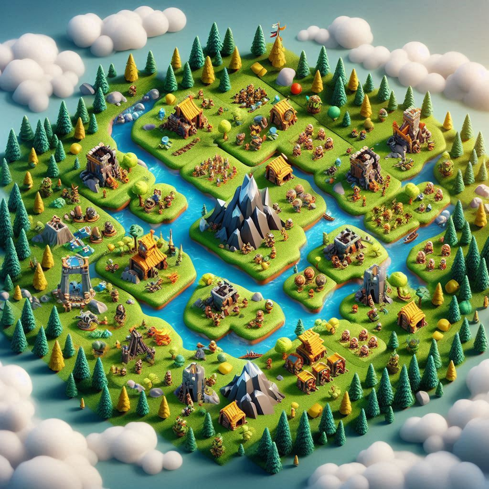
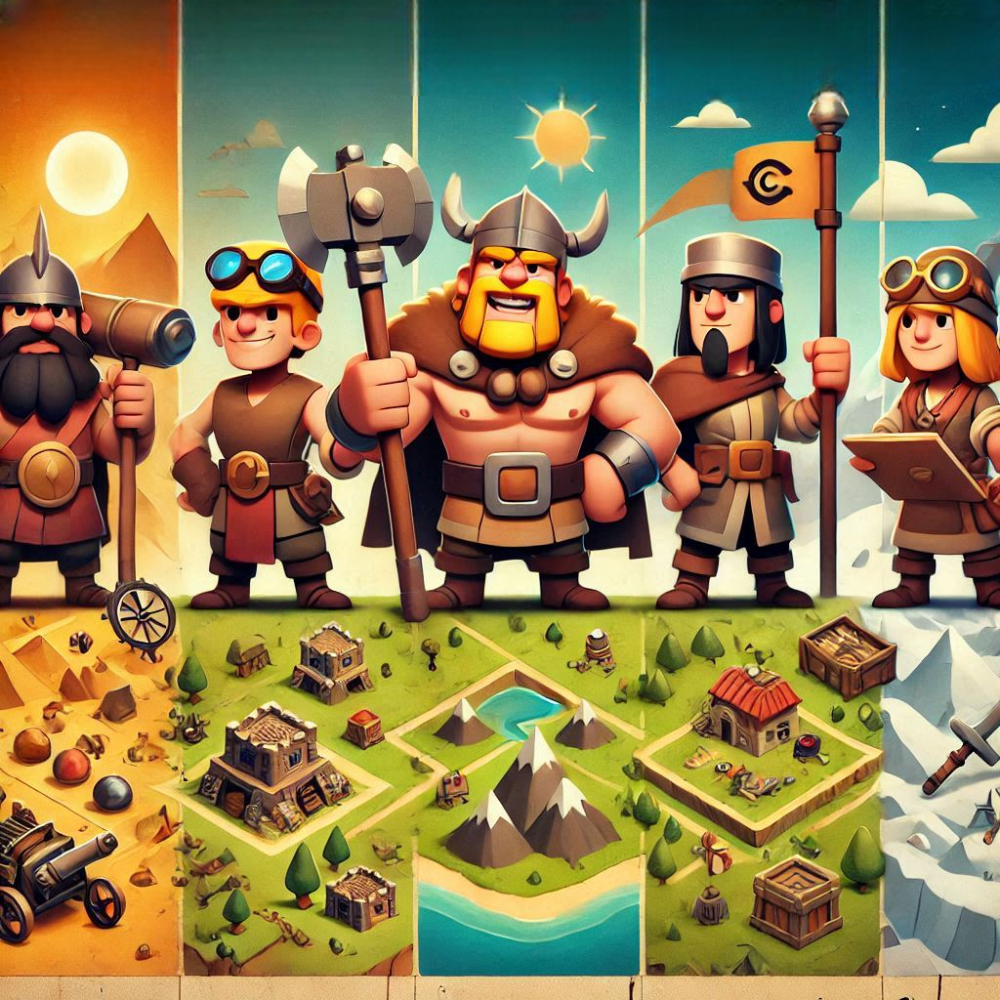
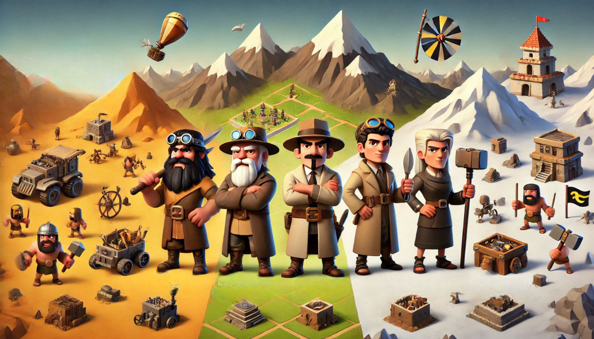
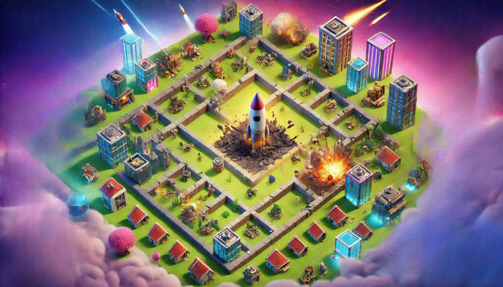

# InventCraft

## Descripción del Proyecto

Se trata de una versión beta de un juego de estrategia individual hecho en Laravel, donde los jugadores compiten por alcanzar la mayor puntuación y construir la Estación Espacial, representando una carrera por el desarrollo tecnológico y la exploración.

## Mapa

- El mapa principal será un cuadrado de 3X3. Esto significa que habrá un total de 9 zonas.
- Cada zona contiene recursos únicos que no están disponibles en otras zonas.
- En las zonas es posible encontrar inventos.
- La dificultad de recolectar recursos depende de la zona, ya que en cada una pueden ocurrir diferentes eventos que le hagan perder los recursos recolectados total o parcialmente. Aunque en esta versión beta está implementada la ocurrencia de estos eventos, solo se informa al jugador cuando le ha supuesto la pérdida total de los recursos recolectados sin informarle de las características del evento.
- El jugador puede crear inventos en todas las zonas.

## Progresión de Jugadores

- Comienza con el nivel 1 y no se ha establecido nivel máximo que el jugador pueda alcanzar
- Experiencia (EXP) ganada por:
  1. Desplazamientos entre zonas exitoso
  2. Creación de inventos
  3. Exploración de una zona y la recolección de recursos en ella
  4. Construcción y mejora de edificios
- Cualidades del jugador:
  1. Los jugadores obtendrán 15 puntos por nivel y 15 puntos iniciales por registrarse. Estos puntos se podrán repartir como deseen.
  2. Una vez repartidos no podrán volverse a usar.
    1. Suerte: Incrementa la probabilidad de encontrar recursos.
    2. Vitalidad: En estos momentos no se implementa su uso, sería conveniente en versiones futuras cambiarla por otra relacionada con la construcción de edificios.
    3. Ingenio: Incrementa la eficiencia al inventar.
    4. Velocidad: Reduce el tiempo de realizar una acción.

## Acciones posibles

- Recolectar: Recoger los recursos de una zona.
  - Los jugadores exploran zonas para recolectar materiales y/o inventos.
- Moverse: Cambiar de una zona a otra.
- Inventar: Crear inventos a partir de un invento anterior o de materiales encontrados.
    - Los jugadores pueden crear inventos a partir de materiales recolectados.
    - Los inventos sirven para crear edificios.
- Construir: Crear edificios.
  - Los edificios otorgan bonificaciones permanentes que afectan a las cualidades del jugador.
  - Construir la estación espacial será la clave para la victoria, aunque siendo el objetivo del juego no está implementado, pues en esta versión no está limitada su construcción.

## Tiempo y Progresión

1. Duración de las Acciones: Los jugadores eligen cuánto tiempo dedicar a una acción con un mínimo de 30 minutos y hasta un máximo de 600 minutos.

  - Explorar: Cuanto más tiempo dediquen, mayor será la cantidad de objetos encontrados.
    - La fórmula para el cálculo de la probabilidad de encontrar cada uno de los materiales disponibles en la zona es:
      > ( 50 - la eficiencia del material + la suerte del jugador + (el tiempo dedicado a la recolección / 30) ) >= valor aleatorio entre 0 y 70
    - De cada objeto se pueden conseguir un valor aleatorio de cantidades según la eficiencia.
      - Valor mínimo 1
      - Valor máximo 9 para aquellos materiales con una eficiencia inferior o igual a 22%
      - Valor máximo 6 para aquellos materiales con una eficiencia superior a 22% e inferior o igual a 30%
      - Valor máximo 3 para aquellos materiales con una eficiencia superior a 30%
    - Por ejemplo, se puede encontrar un jugador con 30 de suerte, pudiendo encontrar un material con 25% de eficiencia e invirtiendo 30 minutos sin penalizaciones de zona: 
      - Su probabilidad de encontrar ese material es = 50 - 25 + (30/30) = 26. 
      - Por lo que siempre que salga un número aleatorio entre 0 y 26 se realizará un random para averiguar la cantidad (entre 1 y 6 por tener una eficiencia del 25%) que obtendrá de ese material.

  - Inventar: Dedicando más tiempo, aumentará la eficiencia del invento hasta 10 horas como máximo.
    - La fórmula será:
      > Eficiencia del material + (ingenio del jugador / 10) + tiempo invertido dividido por 30.
    - Por ejemplo, un jugador de ingenio 20 invirtiendo 60 minutos puede crear una piedra afilada con un material X:
      - Suponemos que la eficiencia del material es 40,5%
      - La eficiencia total será 40,5 + 2 + (60/30) = 44,5 %

  - Construir Edificios: Los edificios tienen tiempos de construcción dependiendo de su nivel.
    - La fórmula será:
      > 10h (600 min) dividido por el nivel del jugador más 1, por el nivel del edificio.
    - Por ejemplo, un jugador de nivel 3 invirtiendo para construir un edificio de nivel 2:
      > Tiempo total = (600 / (3+1) ) * 2 = 400 minutos

## Construcciones y niveles de edificios

Tipos de Edificios e inventos requeridos:
- Estación de Transporte: Carro, Rueda, Barco
- Taller de Manufactura:	Herramientas de piedra, Cuerdas, Lanza, Arco y flechas, Hacha, Cestas, Torno
- Granja: Agricultura, Ganadería, Arado, Trampas para caza, Sistema de riego automatizado
- Planta de Energía:	Fuego, Canales
- Fundición de Metales:	Metalurgia, Vidrio
- Taller de Cerámica:	Cerámica, Alfarería, Horno de alta temperatura
- Fábrica de Textiles:	Tela
- Sistema de Acueductos:	Acueducto, Molino de agua
- Estación espacial:	Requiere todos los edificios con eficiencia 100 %

Al construir un edificio obtiene la eficiencia media de los inventos con los que se ha creado siguiendo la formula siguiente:
> Eficiencia = (suma de eficiencia de inventos / número inventos) / (nivel * 2)

Ejemplo - Edificio de nivel 1:
> Estación de Transporte:	(1 Carro 50%, 1 Rueda 100%, 1 Barco 25.6%) / 3 = 58.53% / 2 = 29,26%

Cada nivel de edificio requiere el doble de los inventos.

Ejemplo - Edificio de nivel 2:
- Eficiencia anterior = 29,26%
> Estación de Transporte: 1 Carro 50%, 1 Carro 40%, 1 Rueda 80%,1 Rueda 100%, 1 Barco 25.6%, 1 Barco 22.4% = 53% / (2 * 2) = 13.25% + 29,26% = 42.51

El nivel podrá subirse hasta conseguir una eficiencia de 100% en el edificio.

Cada edificio aumentará las estadísticas del jugador:
- Estación de Transporte: Velocidad y Suerte en 1 punto
- Taller de Manufactura: Velocidad e Ingenio en 1 punto
- Granja: Vitalidad e Ingenio en 1 punto
- Planta de Energía: Ingenio y Velocidad en 1 punto
- Fundición de Metales: Vitalidad y Suerte en 1 punto
- Taller de Cerámica: Ingenio y Surte en 1 punto
- Fábrica de Textiles: Suerte y Vitalidad en 1 punto
- Sistema de Acueductos: Aumentará una estadística calculada de forma aleatoria en 5 puntos. En estos momentos aumenta 0 puntos dado que no está limitada su construcción a la condición de que se posean todos los demás edificios con una eficiencia del 100%.

## Recursos

- El jugador tendrá un inventario propio que podrá almacenar recursos ilimitados.
- Los inventos creados consumen recursos como materia prima y/o otros inventos para su creación.
- Los inventos han de ser de nivel inferior al del jugado, lo que ocurrirá siempre ya que todos los tipos de inventos tienen un nivel requerido de 1 que es con el nivel que comienza el jugador.
- La probabilidad de encontrar inventos se obtiene con la siguiente fórmula: 50 + suerte del jugador + (tiempo dedicado a la exploración de la zona / 30).
  - Si su probabilidad es igual o superior a 85 y sin que ocurran eventos en la zona, encontrará 3 inventos, el tipo de los mismos se determinará de forma aleatoria.
  - Si su probabilidad es igual o superior a 60 y sin que ocurran eventos en la zona, encontrará 2 inventos, el tipo de los mismos se determinará de forma aleatoria.
  - Si su probabilidad es igual o superior a 40 y sin que ocurran eventos en la zona, encontrará 1 inventos, el tipo del mismo se determinará de forma aleatoria.

## Condiciones de Victoria

- Objetivo Principal: Construir la Estación espacial garantiza la victoria total. Algo que en estos momentos no se puede aplicar ya que no está limitada la construcción de la estación espacial.
- No se puede lograr la victoria total dado que tampoco se ha establecido una puntuación máxima a la que puede llegar el jugador. Si se ha realizado un ranking en el que puedes ver la posición de los 10 primeros y sus puntos para saber cuanto te acercas tu pero no hay posibilidad de victoria en estos momentos.

## Comentarios adicionales

- No se actualizan los recursos en el inventario hasta que la acción de recolectar esta terminada.
- No se permite realizar acciones mientras está en curso una acción previa.
- No se actualizan las estadísticas por beneficios en la construcción de edificios hasta que el edificio se ha construido.
- No aparece el invento creado en el inventario hasta que la acción de crearlo ha concluido. Sin embargo, a nivel de código se debe crear el invento antes de realizar la acción de Crear Invento dado que el id de ese invento es el actionable_id de la Acción. Esto se podría haber solucionado realizando la acción con el id del tipo de invento inicialmente y, al terminar la acción de crear y obtener el id del invento, actualizándolo en la base de datos pero, no he tenido tiempo de implementarlo.
- El cálculo de los puntos de experiencia necesarios para aumentar de nivel se calcula sumándole 1 al nivel del usuario y multiplicándolo por 100.
- Ha sido un proyecto apasionante en el que ha faltado tiempo a pesar de la cantidad de horas diarias invertidas, por eso el código no está lo limpio que me gustaría y soy consciente de que hay archivos que no se utilizan pero no me arriesgo a tocar nada más.

